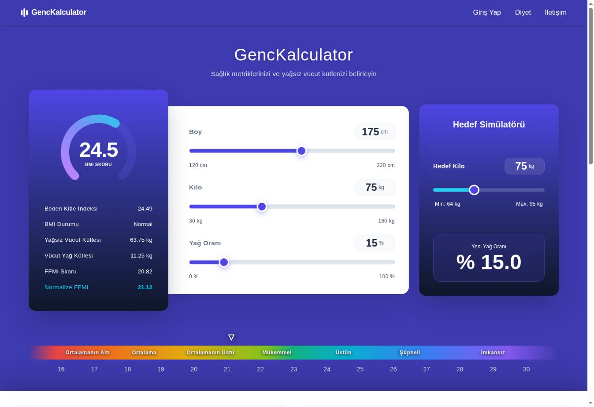
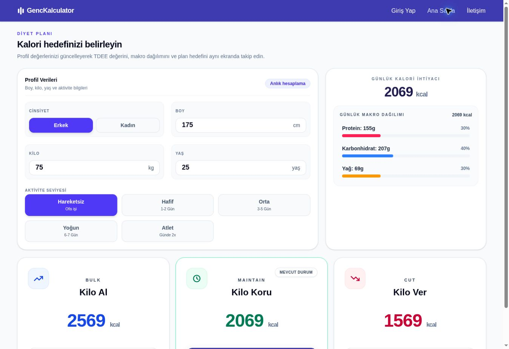

# GençKal — Web Beslenme Planlama Platformu

Kullanıcıların fiziksel verileri ve hedefleri doğrultusunda vücut kompozisyonu, günlük enerji ihtiyacı ve makro besin dağılımı hesaplamaları yaparak kişiselleştirilmiş beslenme planları oluşturmasını sağlayan web ürünü.

[Canlı uygulamayı görüntüle](https://genckal.vercel.app)

| Vücut kompozisyonu ve hedef simülatörü | Kalori ve makro planlama |
| --- | --- |
|  |  |

> **Güncel durum:** Proje aktif geliştirme aşamasındadır. Web uygulamasının hesaplama, hedef belirleme, beslenme planlama ve AI destekli plan üretme akışları canlı ortamda kullanılabilir durumdadır.

## Problem ve Ürün Yaklaşımı

Geleneksel kalori hesaplayıcıları çoğunlukla tek bir sonuç üretir ve kullanıcının vücut kompozisyonunu, hedefini ve beslenme tercihlerini aynı akış içinde değerlendirmez. GençKal; BMI ve FFMI gibi vücut kompozisyonu göstergelerini, TDEE hesaplamasını, kalori hedeflerini ve makro besin dağılımını ortak bir ürün deneyiminde birleştirir.

Ürün, kullanıcının önce mevcut durumunu anlamasını, ardından hedefini belirlemesini ve bu hedefe uygun beslenme planı oluşturmasını sağlayan aşamalı bir bilgi mimarisiyle tasarlanmıştır.

## Rolüm ve Katkılarım

- Ürün kapsamını ve temel kullanıcı ihtiyaçlarını belirledim.
- Hesaplama, hedef simülasyonu ve beslenme planlama akışlarının bilgi yapısını tasarladım.
- Kullanıcıların girdi, sonuç ve hedef bilgileri arasında kuracağı etkileşimi değerlendirdim.
- UI/UX kararlarını alan bilgisi, okunabilirlik ve kullanım kolaylığı açısından yönlendirdim.
- Web ve mobil ürünler arasındaki özellik ve deneyim tutarlılığını takip ettim.
- İşleri aşamalara ayırarak görevleri AI ajanlarına tanımladım; çıktıları işlevsel ve görsel gereksinimlere göre değerlendirdim.

> Ürün kararları, kapsam, kullanıcı akışları ve çıktı değerlendirmesi tarafımdan yürütülmüştür. Kod üretimi AI ajanlarıyla gerçekleştirilmiştir.

## Ürün Özellikleri

- BMI, yağsız vücut kütlesi, yağ kütlesi ve FFMI hesaplamaları
- Hedef kilo ve tahmini yağ oranı simülatörü
- Aktivite seviyesine göre günlük enerji ihtiyacı hesaplama
- Bulk, maintain ve cut hedeflerine göre kalori planlama
- Protein, karbonhidrat ve yağ için makro besin dağılımı
- Öğün sayısı, beslenme tipi ve hariç tutulacak besin tercihlerinin belirlenmesi
- Gemini tabanlı kişiselleştirilmiş beslenme planı üretimi
- Plan içindeki besinleri alternatifleriyle değiştirme
- Kullanıcı hesabı ve oluşturulan planları kaydetme akışları

## Teknolojiler

- Next.js 16, React 19 ve TypeScript
- Tailwind CSS
- React Hook Form ve Zod
- Vercel AI SDK ve Gemini
- Framer Motion
- Playwright, axe-core ve Node.js test araçları

## Yerel Çalıştırma

    npm install
    npm run dev

Temel doğrulama komutları:

    npm test
    npm run test:a11y
    npm run lint
    npm run build

## Mobil Uygulama

GençKal'ın mobil istemcisi Expo ve React Native ile ayrı bir depo olarak geliştirilmektedir.

[GençKal mobil uygulama deposunu incele](https://github.com/BorBozka/GencKal_mobile)

## Kullanım Notu

Bu proje eğitim ve portföy amaçlıdır. Üretilen hesaplamalar ve beslenme planları tıbbi değerlendirme veya kişiye özel sağlık hizmeti yerine geçmez.
